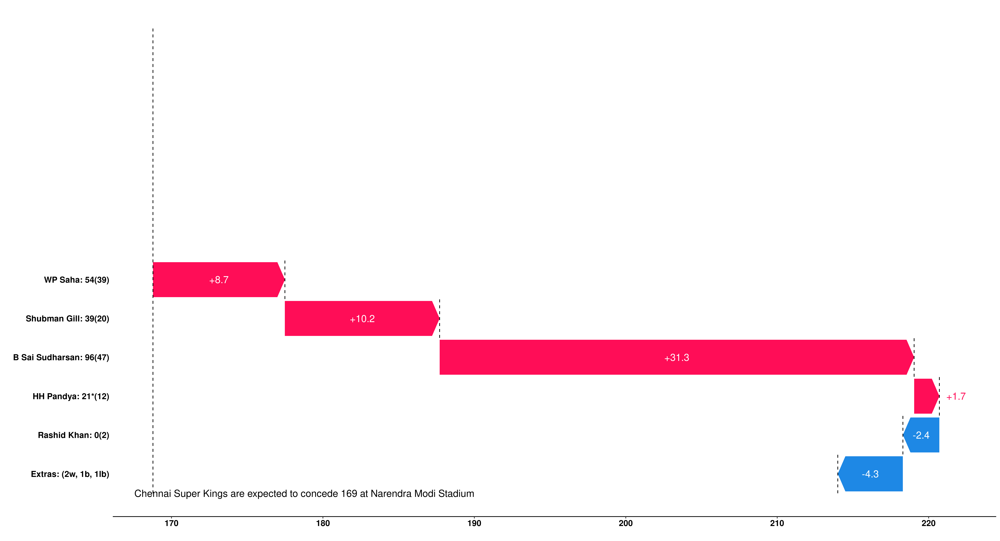
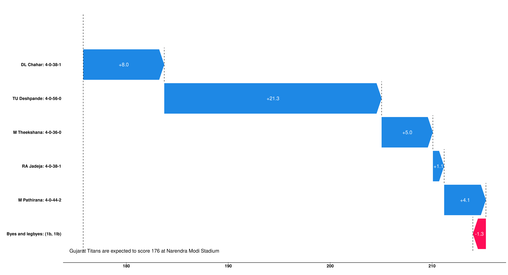
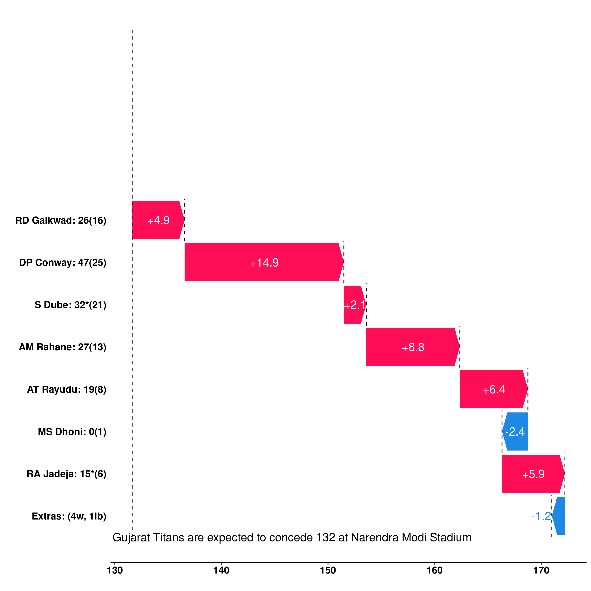
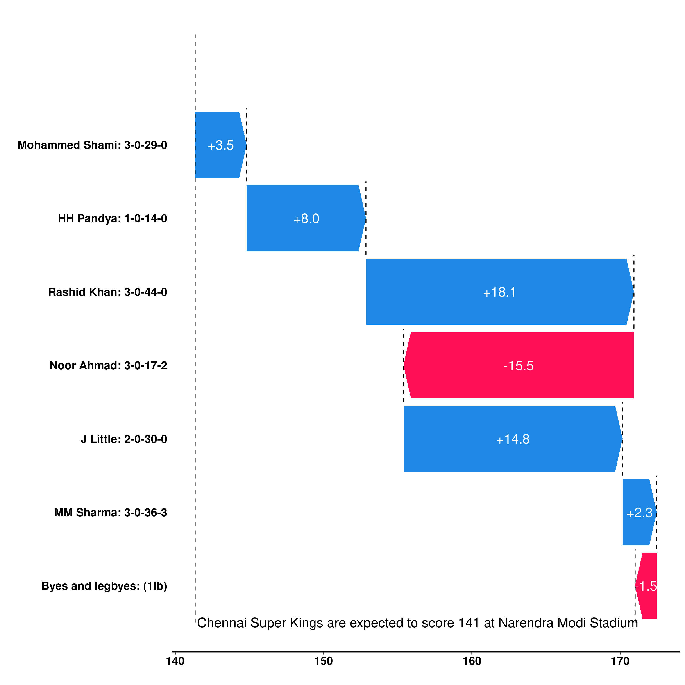

Following on from my previous post, let's see some more contribution scores! The IPL season concluded a few weeks ago, and it was arguably the best yet, with the final being incredibly entertaining.

It was fitting for the highest scoring season in the tournament's history that the final was a runs fest. This has really tested my contribution score metric - the expected runs totals that this metric relies on is based upon a model that is fitted to the last five years of data all of which is equally weighted. Since this was a record scoring season, the contribution scores are therefore generally positive because most scores are greater than what my model expects.

Gujarat batted first and scored 214/4. Let's take a look at the contribution score graphic.

Based upon the bowling attack that Chennai Super Kings chose, an average IPL team would be expected to score 169 at the Narendra Modi stadium. Gujarat scored quite a few more than that primarily due to Sai Sudharsan, with the openers also contributing. We can see an excellent example of the benefits of contribution score compared to traditional metrics in the comparison of the opening partnership -  Shubman Gill has a higher contribution score than Wriddhiman Saha despite scoring 15 less runs.

Let's take a look at the contributions of the bowlers.

Gujarat's expected score against an average IPL bowling attack at this stadium was 176. It makes sense that this is larger than the previous expected score, since both of these teams should be better than average since this was the final. None of the bowlers recorded a contribution score of below zero (signifying an above average performance), but this was a very high scoring match.

There was a delay because of rain during the match interval, but when Chennai came out to bat they were set a DLS adjusted target of 171 runs in 15 overs. In a thrilling chase, Chennai ended up requiring 10 from the final two balls, with Ravi Jadeja being the hero and pulling off a remarkable chase. Let's take a look at the contribution scores of the batters for this innings.

The expected score here (132) is what an average batting team is expected to score against Gujarat's bowling attack in a reduced 15 overs innings. One of the key factors behind the success of CSK's chase was that every batter was very positive and it was a team affair to get them over the line - this is reflected in the contribution scores with six of the seven batters recording a positive contribution score; only MS Dhoni who got a first baller didn't.

Let's now take a look at the contribution scores of the Gujurat bowlers.

The depth of Chennai's batting and the strength of Gujarat's bowling is reflected in the expected score of 141 for this innings - nine runs higher than for the previous graphic, and let's remember that this is only a 15 over innings too. Noor Ahmad was the standout for Gujarat's bowlers and a contribution score of -15.5 reflects this. Not only is this a remarkable score, he was also the only bowler to record a contribution score of less than 0, adding to how unlucky he was to be on the losing side. Rashid Khan had a rare off day and a game to forget.

If you've got any other matches that you would like to see these contribution score graphs for then please let me know!